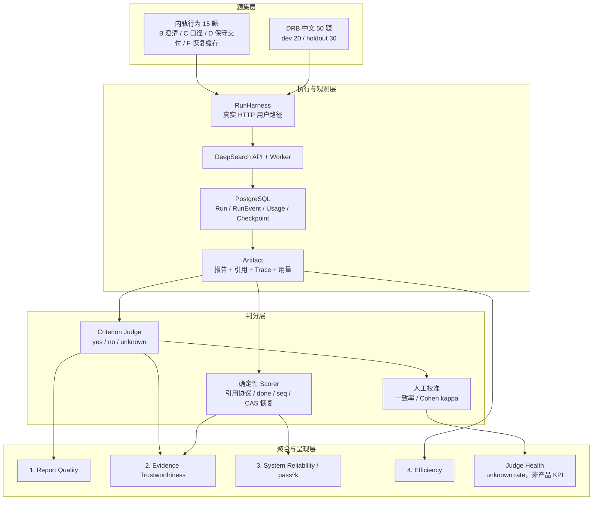

# 评测（双轨）

> 原则：报告质量用**外部可比基准**（DeepResearch Bench 官方 criterion 与权重），
> 系统能力用**自研行为断言**；两套分数并列呈现，**绝不合成单一总分**——
> 综合分会让华丽文风掩盖引用造假，也会让工程稳定掩盖内容空洞。

## 双轨结构

| 轨 | 题目来源 | 判分 | 用途 |
|---|---|---|---|
| 外轨 | DRB 中文 50 题（dev 20 / holdout 30 固定切分） | 专家二元 criterion × LLM judge（带专家参考对照）+ 确定性门 | 可比性、防自吹 |
| 内轨 | `cases/behavior.jsonl` 15 题（B 澄清 5 / C 口径 2 / D 保守交付 4 / F 恢复缓存 4） | 行为断言以 deterministic 为主，judge 只做布尔断言 | 我们独有的能力面 |

内轨是 DRB 这种"一次性 prompt→报告"基准测不到的：人机澄清全链路（含 payload
单次消费）、证据不足时的保守交付、租约接管/优雅停机/语义缓存。

## 版权边界

DRB 代码 MIT、**数据集另有许可**。本仓库不落任何一行 DRB 题目/criterion/
参考文章内容；`drb.py` 只在你本机 clone 的 `$DRB_ROOT` 上运行时解析。
公开发布时 results/ 只含我们自己的报告与分数。

## 准备

```bash
git clone https://github.com/Ayanami0730/deep_research_bench ~/Desktop/deep_research_bench
export DRB_ROOT=~/Desktop/deep_research_bench

# 生成 dev/holdout 切分（固定种子，全组同一份，勿手改）
uv run python -m evals.cli split --dev 20

# 评测账号 + 被测服务（API 与至少 1 个 Worker，或 embedded）
export EVAL_BASE_URL=http://127.0.0.1:8080
export EVAL_EMAIL=eval@local.dev EVAL_PASSWORD=***
export SERVICE_DATABASE_URL=postgresql+asyncpg://...   # 行为断言需要 DB 特权读
```

## 流水线

```bash
uv run python -m evals.cli run   --track behavior          # 提交/澄清/产物
uv run python -m evals.cli score                           # 确定性门+行为断言（零费用）
uv run python -m evals.cli judge                           # 二元 rubric（LLM 调用，计入成本）
uv run python -m evals.cli annotate                        # → results/annotate.csv 人工填
uv run python -m evals.cli annotate --import-csv results/annotate.csv   # 人机一致率 + Cohen κ
uv run python -m evals.cli report                          # 记分表
```

judge 模型默认复用 `LLM_MODEL_ID`，`EVAL_JUDGE_MODEL` 可覆盖。

## 判分纪律

- **criterion 级**判定：yes / no / **unknown**。judge 每条独立调用，禁止整篇
  印象分；unknown 率是分维度 rubric 歧义的反查信号。
- 外轨 case pass = 确定性门全绿 且 四维加权 ≥ 75。
- 内轨 case pass = 门全绿 且 全部行为断言 yes（judge 断言 unknown 也算不过）。
- 过程指标（token/费用/时长/缓存命中）**只记录不判分**——路径不打分，结果打分。
- `pass@3`（三次至少一次）与 `pass^3`（三次全过）并列报告；对面向用户的长任务
  服务，`pass^3` 才是承诺口径。
- `unknown` 代表评审器没有交付有效判定：报告缺失要求内容应判
  `no`；仍出现的 `unknown` 不允许 case 通过，并单独进 unknown rate 供校准。
- F1/F2（kill/stop 接管）需要 harness 掌控 worker 进程（phase 2，按
  `scripts/verify_m8_processes.py` 的编排模式接线）；`--with-faults` 才会列出。

## 与防过拟合的关系

holdout 30 题只出分、不逐题翻失败轨迹；dev 20 题允许归因迭代。改提示词/阈值
只准看 dev。将来若向 DRB 官方排行榜提交，按全 100 题协议另行执行。

## 对外指标：只保留四个

criterion 是题目的二元判据，用于定位失败，**不是对外指标**。报表和简历
只呈现下列四项：

1. **Report Quality**：DRB 官方四维 criterion 加权后的单一质量分；
2. **Evidence Trustworthiness**：引用协议完整性、claim–quote 支持度与来源质量的聚合分；
3. **System Reliability**：内轨行为用例的 pass rate 与 `pass^k`，不再拆成每个状态机细项；
4. **Efficiency**：每个成功 run 的 token / 耗时 / 费用，只做成本趋势，不决定质量通过。

Unknown Rate 和人机一致率属于 **Judge 健康度**，是评测系统的监控信号，
不当作 DeepSearch 的产品 KPI。

> 当前 Evidence Trustworthiness 只有“引用协议完整性”这一层已自动化；
> claim–quote 语义支持度和来源质量仍是缺口，未补齐前不对外宣称已完成
> Groundedness 评测。

## 完整结构



DRB 的四个 dimension 和题内 criterion 都属于 Report Quality 的内部计算与
归因层；内轨的状态机断言都属于 System Reliability 的归因层。它们
可以在调试时展开，但不在总览报表平铺。
